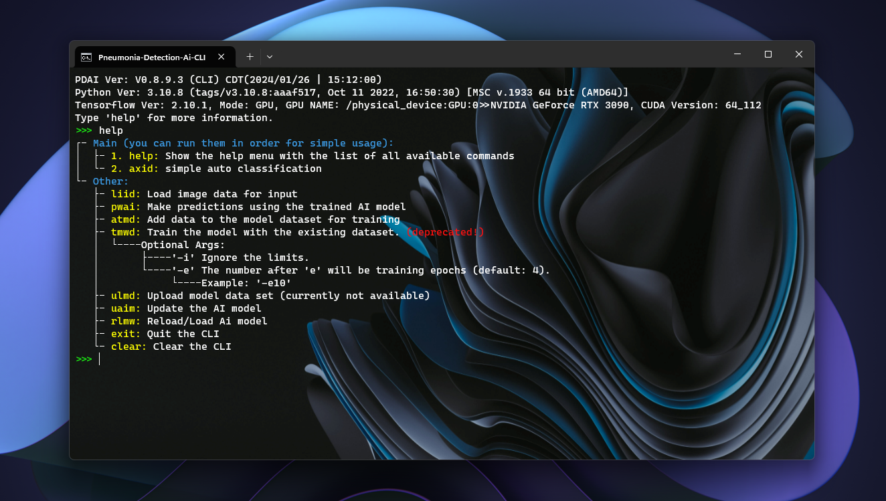
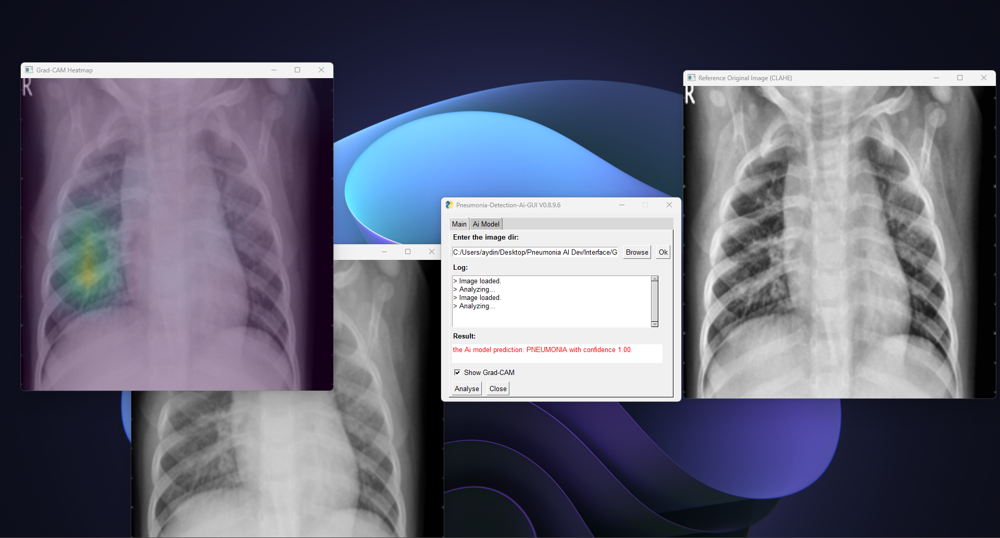
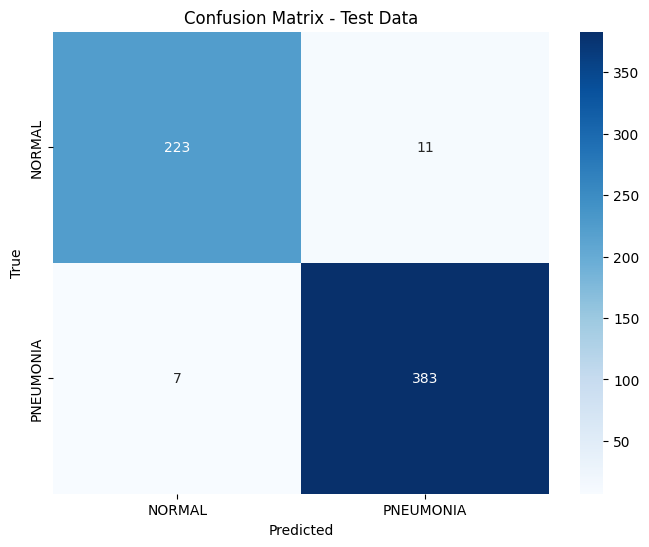
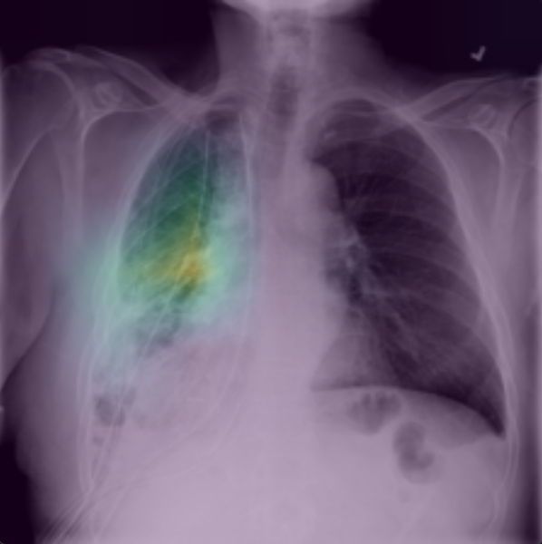
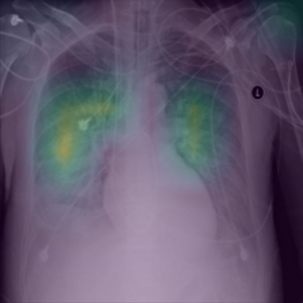
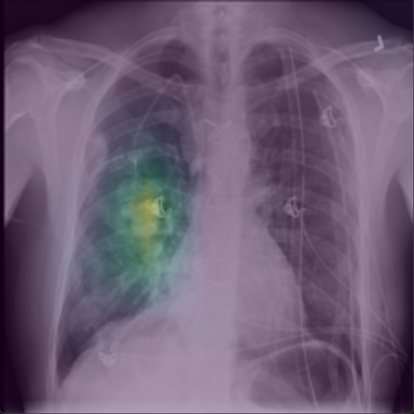
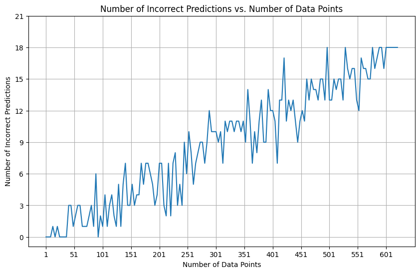
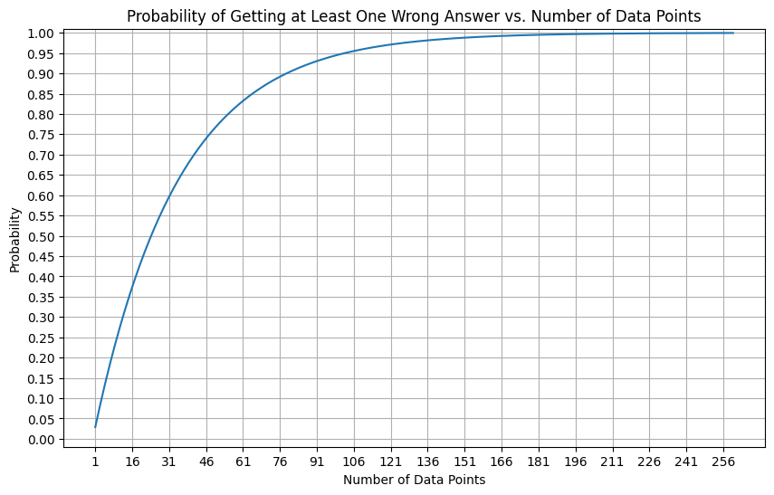
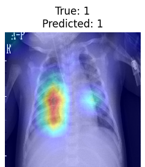

# Pneumonia Detection AI 🤖

    

[](https://opensource.org/licenses/MIT)
[](https://github.com/astral-sh/ruff)
[](https://github.com/Aydinhamedi/Pneumonia-Detection-Ai/actions/workflows/codeql.yml)
[](https://github.com/Aydinhamedi/Pneumonia-Detection-Ai/actions/workflows/dependency-review.yml)\
[](https://github.com/Aydinhamedi/Pneumonia-Detection-Ai/actions/workflows/ruff_L&F-Main.yml)
[](https://github.com/Aydinhamedi/Pneumonia-Detection-Ai/actions/workflows/ruff_L&F-Beta.yml)
[](https://github.com/Aydinhamedi/Pneumonia-Detection-Ai/actions/workflows/ruff_L&F-Alpha.yml)

# <h1><p align="center">**🚧Deprecated🚧**</p></h1>

### This project uses a deep learning model built with the TensorFlow Library to detect pneumonia in X-ray images. The model architecture is based on the EfficientNetB7 model, which has achieved an accuracy of approximately 97.12% (97.11538%) on our test data. This high accuracy rate is one of the strengths of our AI model.
> [!IMPORTANT]
> The code that had achieved the highest acc is `backup/V6/Model_T&T.ipynb`.\
> And the codes with the light and super light models are `backup/V7/Model_T&T.ipynb`, `backup/V8/Model_T&T.ipynb`.

## Usage
> [!TIP]
> If you just want the model go to the Github Releases.

> [!NOTE]
>  This model was built using the [EfficientNet ](https://github.com/qubvel/efficientnet) library,
>  which is a collection of state-of-the-art models for image classification. To use the model,
>  you need to install the library and import it as follows:
> ```python
> import efficientnet.tfkeras
> ```
> Or clone the project and use `Utils.FixedDropout`:
> ```python
> from Utils.FixedDropout import FixedDropout
> from keras.models import load_model
> 
> # Load the model
> model = load_model('PAI_model_T.h5', custom_objects={'FixedDropout': FixedDropout})
> ```

The project includes a Command Line Interface (CLI) and a (GUI) Graphical User Interface for easy use of the model. The CLI, which is based on the [Python CLI template](https://github.com/Aydinhamedi/Python-CLI-template) from the same author, provides a user-friendly, colorful interface that allows you to interact with the model. you can fined the CLI in 
> [!CAUTION]
> The last version of CLI is V0.8.9.3 and currently its has entered a minimal maintenance and not being updated ***and its going to be deprecated***. 
```
Interface\CLI
```
Additionally, a Graphical User Interface (GUI) is available. you can fined the GUI in
```
Interface\GUI
```
### Example Image of the CLI (V0.8.9.3) ⤵
  
### Example Image of the GUI (V0.8.9.6) ⤵
  

## Release
> ### Newest release 📃
> #### [Go to newest release](https://github.com/Aydinhamedi/Pneumonia-Detection-Ai/releases/latest)

## Training System Specifications

- **Graphics Card (GPU)**: RTX 3090
- **Memory (RAM)**: 64GB
- **Operating System (OS)**: Windows 11 Pro
- **Processor (CPU)**: Intel Core i7-12700KF

## Model

The model is a Convolutional Neural Network (CNN) trained on a dataset of 23681 X-ray images. The dataset is a combination of the following:

- Chest X-ray Pneumonia dataset from Kaggle
- Covid19-Pneumonia-Normal Chest X-Ray Images from Mendeley
- RSNA dataset

This combined dataset provides a comprehensive set of images for training the model.\

### Model list:
| Model    | Base Model      | Params | acc    | Status | Grad Cam |
|----------|-----------------|--------|--------|--------|----------|
| V6       | efficientnet-b7 | 65.4M  | 97.12% |   ✅   |  ✅  | 
| V7 light | efficientnet-b4 | 29.7M  | 97.12% |   ✅   |  ⚠️  | 
| V8 Super light | efficientnet-b0 | 4.8M  | 96.47% |  ✅  |   ❌  | 

## Training Methods
### The AI model supports two distinct training approaches:

- rev1: A straightforward method using Keras fit function for basic training.
- rev2: An enhanced training strategy incorporating data augmentation and subset training for improved accuracy and generalization.
### rev2 Training Simplified:
- Memory Optimization: Begins with clearing system memory to ensure efficient resource utilization.
- Hyperparameter Setup: Configures essential training parameters such as epoch count and batch size.
- Data Enrichment: Utilizes data augmentation techniques to introduce variability in the training dataset.
- Focused Training: Implements training on data subsets to reduce overfitting and streamline the learning process.
- Adaptive Learning Rate: Applies a dynamic learning rate schedule to fine-tune the training progression.
- Training Supervision: Uses callbacks for monitoring training, saving the best model, and enabling early stopping.
- Progressive Learning: Trains the model iteratively on subsets, evaluating and adjusting after each epoch.
- Data Standardization: Normalizes image inputs to facilitate model training.
- Robustness Enhancement: Introduces random noise to training images to strengthen model robustness against unseen data.
- While rev1 is suitable for quick and simple model training, rev2 is tailored for those seeking a more sophisticated and potentially more effective training regimen.

## Repository Structure

Please note that due to the large size of some files and folders, they are not available directly in the repository. However, they can be found in the [Releases](https://github.com/Aydinhamedi/Pneumonia-Detection-Ai/releases) page of the repository. This includes the model weights and the database, which are crucial for the functioning of the AI model.

## Contribution

Any contributions to improve the project are welcome. You can submit a pull request or open an issue on GitHub. Please make sure to test your changes thoroughly before submitting. We appreciate your help in making this project better.

## WARNING
> [!CAUTION]
The model provided in this project should not be used for medical diagnosis without further validation. While the model has shown high accuracy in detecting pneumonia from X-ray images, it is not a substitute for professional medical advice. Please consult with a healthcare professional for medical advice.


## Other
> [!NOTE]
> Please note that this code uses my:
> - Python-CLI-template
>   - for more info go to https://github.com/Aydinhamedi/Python-CLI-template.
> - Python-color-print-V2
>   - for more info go to https://github.com/Aydinhamedi/Python-color-print-V2.
> - Python-color-print
>   - for more info go to https://github.com/Aydinhamedi/Python-color-print.

## Results

> [!WARNING]
> Results were achieved using Rev2 training method and Rev1.2 model and
> with `backup/V6/Model_T&T.ipynb` code.
<!-- #### N/A --> 
### Acc:

### Grad cam:
| Model    | Grad-cam Ex |
|----------|----------|
| V6       | |
| V7 light | 🚧None🚧|
| V8 super light | 🚧None🚧|
### Other:

<!--




--> 
<!--
  
-->


## License

This project is open-source and is licensed under the MIT License. See the `LICENSE` file for details.
