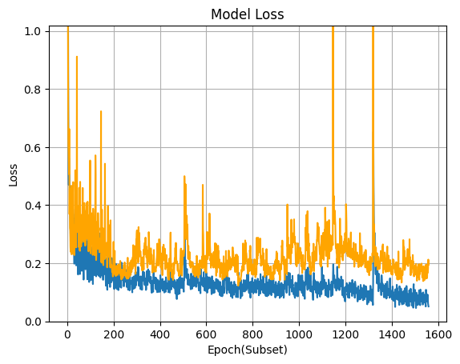

# Pneumonia Detection AI
  

### This project uses a deep learning model built with the TensorFlow framework to detect pneumonia in X-ray images. The model architecture is based on the EfficientNetB7 model, which has achieved an accuracy of approximately 97% (96.96%) on our test data. This high accuracy rate is one of the strengths of our AI model.
> [!IMPORTANT]
> The code that have achived the highest acc is `backup/V4/Model_T&T.ipynb`.
## Usage
> [!TIP]
> If you just want the model go to the Github Releases.

The project includes a Command Line Interface (CLI) for easy use of the model. The CLI, which is based on the [Python CLI template](https://github.com/Aydinhamedi/Python-CLI-template) from the same author, provides a user-friendly, colorful interface that allows you to interact with the model. you can fined the cli in 

```
Interface\CLI
```
### Example Image of the CLI:
  
## Release
> ### Newest release 📃
> #### [Go to newest release](https://github.com/Aydinhamedi/Pneumonia-Detection-Ai/releases)

## Model

The model is a Convolutional Neural Network (CNN) trained on a dataset of 8888 X-ray images. The dataset is a combination of the [chest-xray-pneumonia](https://www.kaggle.com/datasets/paultimothymooney/chest-xray-pneumonia) dataset from Kaggle and the [Covid19-Pneumonia-Normal Chest X-Ray Images](https://data.mendeley.com/datasets/dvntn9yhd2/1) from Mendeley.


## Training Methods
### The AI model supports two distinct training approaches:

- rev1: A straightforward method using Keras' fit function for basic training.
- rev2: An enhanced training strategy incorporating data augmentation and subset training for improved accuracy and generalization.
### rev2 Training Simplified:
- Memory Optimization: Begins with clearing system memory to ensure efficient resource utilization.
- Hyperparameter Setup: Configures essential training parameters such as epoch count and batch size.
- Data Enrichment: Utilizes data augmentation techniques to introduce variability in the training dataset.
- Focused Training: Implements training on data subsets to reduce overfitting and streamline the learning process.
- Adaptive Learning Rate: Applies a dynamic learning rate schedule to fine-tune the training progression.
- Training Supervision: Uses callbacks for monitoring training, saving the best model, and enabling early stopping.
- Progressive Learning: Trains the model iteratively on subsets, evaluating and adjusting after each epoch.
- Data Standardization: Normalizes image inputs to facilitate model training.
- Robustness Enhancement: Introduces random noise to training images to strengthen model robustness against unseen data.
- While rev1 is suitable for quick and simple model training, rev2 is tailored for those seeking a more sophisticated and potentially more effective training regimen.

## Repository Structure

Please note that due to the large size of some files and folders, they are not available directly in the repository. However, they can be found in the [Releases](https://github.com/Aydinhamedi/Pneumonia-Detection-Ai/releases) page of the repository. This includes the model weights and the database, which are crucial for the functioning of the AI model.

## Contribution

Any contributions to improve the project are welcome. You can submit a pull request or open an issue on GitHub. Please make sure to test your changes thoroughly before submitting. We appreciate your help in making this project better.

## WARNING
> [!CAUTION]
The model provided in this project should not be used for medical diagnosis without further validation. While the model has shown high accuracy in detecting pneumonia from X-ray images, it is not a substitute for professional medical advice. Please consult with a healthcare professional for medical advice.


## Other
> [!NOTE]
> Please note that this code uses my:
> - Python-CLI-template
>   - for more info go to https://github.com/Aydinhamedi/Python-CLI-template.
> - Python-color-print-V2
>   - for more info go to https://github.com/Aydinhamedi/Python-color-print-V2.
> - Python-color-print
>   - for more info go to https://github.com/Aydinhamedi/Python-color-print.

## Results

> [!WARNING]
> Results were achived using Rev2 training method and Rev1.2 model.
<!-- #### N/A --> 

  
<!--
  
-->


## License

This project is open-source and is licensed under the MIT License. See the `LICENSE` file for details.
